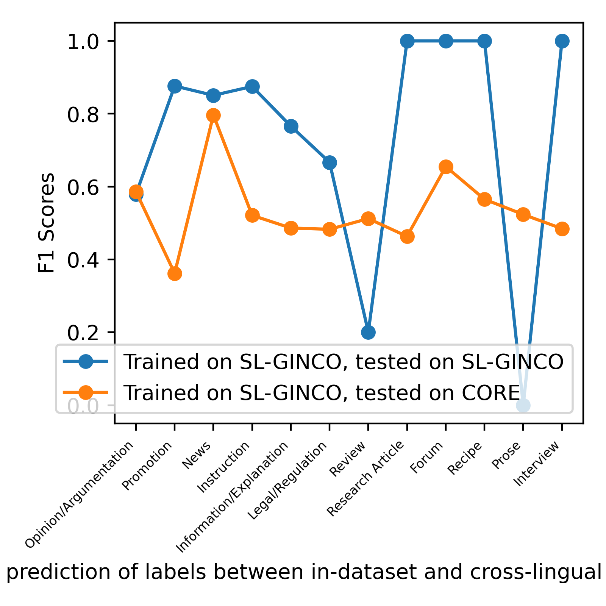

# Cross-dataset and cross-lingual experiments

This repository contains the code used in the experiments presented in:

[Kuzman, Taja, Nikola Ljubešić, and Senja Pollak. "Assessing comparability of genre datasets via cross-lingual and cross-dataset experiments." Jezikovne tehnologije in digitalna humanistika: zbornik konference, Jezikovne tehnologije in digitalna humanistika: zbornik konference. 2022.](https://nl.ijs.si/jtdh22/pdf/JTDH2022_Kuzman-et-al_Assessing-Comparability-of-Genre-Datasets.pdf)

Licensed under the MIT License. See LICENSE. If you use this code, please cite the paper, mentioned above.

## Overview of the task

We perform monolingual in-dataset and cross-lingual cross-dataset text classification (automatic genre identification) experiments to explore comparability of two genre-annotated corpora, English CORE corpus and Slovene GINCO corpus. To this end, we 1) train and test on the same dataset to obtain baseline results (in-dataset experiments), 2) train on Slovene corpus and test on English corpus (cross-lingual cross-dataset classification) and vice versa to see whether we can achieve cross-lingual transfer by using these two datasets, 3) train on Slovene corpus, machine-translated to English, and test on English corpus (cross-lingual cross-dataset classification) to explore whether there is any difference between using the GINCO dataset in Slovene and in English in in-dataset and cross-dataset experiments.

In addition to this, we compare two multilingual Transformer models on these tasks: (base-sized) XLM-RoBERTa and CroSloEngual BERT.

### Datasets
We perform experiments on 3 datasets, all using the GINCORE labels:
* Slovene GINCO - SL-GINCORE (SL_GC), "SL-GINCO" in the notebooks with experiments;
* English CORE - EN-GINCORE (EN_C), "CORE" in the notebooks with experiments;
* machine-translated GINCO - MT-GINCORE (MT_GC: SL_GC, machine-translated to English), "MT-GINCO" in the notebooks with experiments.

SL-GINCORE and MT-GINCORE are available in the **data** folder, while the EN-GINCORE is not available - it will be published by the dataset authors in the near future.

### Experiments
We did three runs of each experiment.

In practice, in each run, we train each model and then test it parallely on multiple test datasets.

1. train on SL_GC, test on:
    * SL_GC (monolingual in-dataset)
    * EN_GC (cross-lingual cross-dataset)

2. train on MT_GC, test on:
    * MT_GC (monolingual in-dataset)
    * EN_GC (cross-lingual cross-dataset)

3. train on EN_GC, test on:
    * EN_GC (monolingual in-dataset)
    * SL_GC (cross-lingual cross-dataset)
    * MT_GC (cross-lingual cross-dataset)

## Preparation of the corpora
You can find the code for the data preparation in the following notebooks:
* CORE: *1-Initial-Analysis-of_CORE.ipynb*, *1.1-Analysis_and stratified_split of_cleaned_CORE.ipynb*, *1.2-Detect-English-Variant-in-CORE.ipynb*
* GINCO: *2.1-Add-GINCORE-labels-to-GINCO.ipynb*, *2.2-Prepare-GINCO-for-MT-keep-text.ipynb*, *2.3-Analysis_and stratified_split of_GINCO.ipynb*

We used only GINCORE labels which are represented by at least 5 instances in each of the dataset: 12 GINCORE labels (see more information on the mapping to the GINCORE schema [here](https://tajakuzman.github.io/GINCO-Genre-Annotation-Guidelines/genre_pages/GINCORE_mapping.html).

We performed a stratified split of each dataset 60:20:20 according to the label distribution.

### CORE - EN-GINCORE
* We discarded 6,918 texts annotated with multiple labels.
* We mapped (15) GINCORE labels to the original CORE labels, used only labels that will be used in GINCO as well --> used only instances belonging to the 12 GINCORE labels.

Final number of texts: 33,918 texts, train-dev-test split: 20,350 : 6,784 : 6,784

| | EN-GINCORE text length            |
|----------------------|--------------|
| count                | 33918.00000  |
| mean                 | 1266.38711   |
| std                  | 3229.96619   |
| min                  | 52.00000     |
| 25%                  | 352.00000    |
| 50%                  | 649.00000    |
| 75%                  | 1175.00000   |
| max                  | 118278.00000 |

### Slovene GINCORE - SL-GINCORE
* We joined paragraphs into one block of text per document, used only paragraphs that are marked to be useful with the attribute "keep" (as we realised that using deduplicated paragraphs was incorrect, as in the annotation procedure, annotators never considered just the deduplicated paragraphs - the labels on the deduplicated text might not be correct. If we use deduplicated text, some instances have no text or less than 10 words.)
* We used only labels that appear in GINCO and EN-GINCORE and have more than 5 instances.

Final number of texts: 810 texts, train-dev-test split: 486 : 162 : 162

Text length in SL-GINCORE:

|    | SL-GINCORE text length|
|-----------|--------------|
| count   | 810.00000  |
|  mean | 364.40000  |
|  std  | 485.34383  |
|  min  | 12.00000   |
|  25%    | 97.25000   |
|  50%    | 198.50000  |
|  75%  | 424.50000  |
|  max  | 4134.00000   |

### Machine-translated GINCO - MT-GINCORE
* We used the same text (paragraphs with attribute "keep") as in the Slovene SL-GINCORE and performed machine translation into English on it. We used the [DeepL machine translation system](https://www.deepl.com/translator). As target language, British variety of English was used, as the English CORE corpus is derived from the General section of the GloWbE corpus (Corpus of Global Web-based English) where British variety is more present than American considering the number of web pages (i.e. web documents), although they are almost equally distributed, considering the number of words (see https://www.english-corpora.org/glowbe/). The prevalence of the British variety was confirmed with the [American-British-variety Classifier](https://github.com/macocu/American-British-variety-classifier):

Variety distribution in EN-GINCORE:
|     |   variant |
|:----|----------:|
| British   |     13,884 |
| Unknown |      9,693 |
| American   |      8,714 |
| Mixed |      2,557 |

In percentages:
|     |   variant |
|:----|----------:|
| British   | 0.398416  |
| Unknown | 0.278151  |
| American   | 0.250057  |
| Mixed | 0.0733758 |

 * We discarded labels with less than 5 instances, used only labels that appear in EN-GINCORE as well.

Final number of texts: see SL_GINCORE (above)

### Labels Distribution

Labels, marked with an * were not used in the experiments. Some of them were dicarded because they contained less than 5 instances in GINCO (Script/Drama, FAQ, Lyrical), others were discarded because they are not present in CORE.

The final list of labels, used in the experiments:
```
LABELS = ['News', 'Forum', 'Opinion/Argumentation', 'Review', 'Research Article', 'Information/Explanation', 'Promotion', 'Instruction', 'Prose', 'Interview', 'Legal/Regulation', 'Recipe']
```

GINCORE labels in CORE:

|                         |   labels |   final %  |
|:------------------------|----------|-----------:|
| News                    |    12658 | 0.373194   |
| Opinion/Argumentation   |     8980 | 0.264756   |
| Information/Explanation |     3406 | 0.100419   |
| Forum                   |     3108 | 0.0916328  |
| Review                  |     1687 | 0.0497376  |
| Instruction             |     1200 | 0.0353794  |
| Promotion               |     1026 | 0.0302494  |
| Research Article        |      804 | 0.0237042  |
| Lyrical*                |      636 | NA         |
| Interview               |      420 | 0.0123828  |
| Prose                   |      276 | 0.00813727 |
| FAQ*                    |      272 | NA         |
| Legal/Regulation        |      186 | 0.00548381 |
| Recipe                  |      167 | 0.00492364 |
| Script/Drama*           |       22 | NA         |


GINCORE labels in (Slovene and MT) GINCO:

|                            |   GINCORE |   final %  |
|:---------------------------|-----------|-----------:|
| Promotion                  |       209 | 0.258025   |
| News                       |       204 | 0.251852   |
| Information/Explanation    |       130 | 0.160494   |
| Opinion/Argumentation      |       114 | 0.140741   |
| List of Summaries/Excerpts*|       106 | NA         |
| Forum                      |        52 | 0.0641975  |
| Instruction                |        38 | 0.0469136  |
| Other*                     |        34 | NA         |
| Review                     |        17 | 0.0209877  |
| Legal/Regulation           |        17 | 0.0209877  |
| Announcement*              |        17 | NA         |
| Correspondence*            |        16 | NA         |
| Call*                      |        11 | NA         |
| Research Article           |         9 | 0.0111111  |
| Interview                  |         8 | 0.00987654 |
| Recipe                     |         6 | 0.00740741 |
| Prose                      |         6 | 0.00740741 |
| Lyrical*                   |         4 | NA         |
| FAQ*                       |         3 | NA         |
| Script/Drama*              |         1 | NA         |

### Hyperparameters

* Separate sets of hyperparameters were defined for EN-GINCORE and SL- and MT-GINCORE. The hyperparameter search was performed by training on train data and testing on dev data. For both, the max_seq_length 512 was used and the default train_batch_size (8). Number of epochs (num_train_epochs) and learning_rate were defined with the hyperparameter search, where I first experimented with different epochs (setting the learning rate to 1e-5) and then with different learning rates (setting the number of epochs to the optimum number, found in previous step). For details, see the code and results in the folders **hyperparameter-search-crosloengualbert** and **hyperparameter-search-RoBERTa**.

Optimum learning rate was revealed to be 1e-5. The final hyperparameters are the same for both corpora in all aspects, except the no. of epochs.

#### XLM-RoBERTa

```
GINCO_epoch = 60
CORE_epoch = 9
```

Final hyperparameters:
```
        args= {
             "overwrite_output_dir": True,
             "num_train_epochs": epochs,
             "labels_list": LABELS,
             "learning_rate": 1e-5,
             "no_cache": True,
             "no_save": True,
             "max_seq_length": 512,
             "save_steps": -1,
             "use_multiprocessing": True,
             "use_multiprocessing_for_evaluation":True,
             }
```

Performance of the models on the dev split with final parameters:
* SL-GINCORE: Macro F1: 0.754, Micro F1: 0.765
* EN-GINCORE: Macro F1: 0.696, Micro F1: 0.753,

### CroSloEngual BERT

```
GINCO_epoch = 90
CORE_epoch = 6
```

Final hyperparameters:
```
        args= {
             "overwrite_output_dir": True,
             "num_train_epochs": epochs,
             "labels_list": LABELS,
             "learning_rate": 1e-5,
             "no_cache": True,
             "no_save": True,
             "max_seq_length": 512,
             "save_steps": -1,
             "silent":True,
             }
```

Performance of the models on the dev split with final parameters:
* SL-GINCORE: Macro F1: 0.673, Micro F1: 0.759 
* EN-GINCORE: Macro F1: MacroF1: 0.724, Micro F1: 0.765

! Note: when training with CroSloEngual BERT, do not use ```os.environ["TOKENIZERS_PARALLELISM"] = "false"```, because it produces errors.

## Results of the experiments

The code for the machine learning experiments is located here:
* *3.1-Dummy-Classifier.ipynb*
* *3.2-XML-RoBERTa-Classification-Experiments.ipynb*
* *3.3-CroSloEngualBERT-Classification-Experiments.ipynb*
* *4-Analysing-Results-XLM-RoBERTa.ipynb*
* *4.1-Analysing-Results-CroSloEngualBERT.ipynb*

See more details on the results in the folder **results-CroSloEngualBERT** and **results-RoBERTa**.

### Dummy classifier
1. On SL-GINCORE, MT-GINCORE:
* most-frequent: Macro F1: 0.034, Micro F1: 0.259
* stratified: Macro F1: 0.064, Micro F1: 0.179

2. On EN-GINCORE:
* most-frequent: Macro F1: 0.036, Micro F1: 0.363
* stratified: Macro F1: 0.070, Micro F1: 0.226

### XLM-RoBERTa (XLM-R) and CroSloEngual BERT (CSE BERT)

1.	In-dataset experiments:

| Setup (Trained on, Tested on) | Micro F1 (XMR) | Macro F1 (XMR) | Micro F1 (CSE BERT) | Macro F1 (CSE BERT) |
|-------------------------------|----------------|----------------|---------------------|--------------------:|
| SL-GINCORE, SL-GINCORE            | 0.782 +/- 0.02 | 0.725 +/- 0.01 | 0.738 +/- 0.01      |      0.599 +/- 0.06 |
| MT-GINCORE, MT-GINCORE            | 0.807 +/- 0.01 | 0.841 +/- 0.03 | 0.714 +/- 0.0       |      0.501 +/- 0.05 |
| EN-GINCORE, EN-GINCORE                    | 0.768 +/- 0.0  | 0.715 +/- 0.0  | 0.761 +/- 0.0       |       0.706 +/- 0.0 |

Analysis of F1 scores per labels showed that differences in macro F1 between SL_GC and MT_GC occurred mostly because MT_GC better predicted very rare categories. That is why is repeated runs two more times to be able to calculate average scores and leave less to chance.


2. Cross-lingual and cross-dataset experiments:

| Setup (Trained on, Tested on) | Micro F1 (XMR) | Macro F1 (XMR) | Micro F1 (CSE BERT) | Macro F1 (CSE BERT) |
|-------------------------------|----------------|----------------|---------------------|--------------------:|
| SL-GINCORE, EN-GINCORE                | 0.639 +/- 0.01 | 0.539 +/- 0.01 | 0.547 +/- 0.02      |      0.391 +/- 0.02 |
| MT-GINCORE, EN-GINCORE                | 0.625 +/- 0.01 | 0.521 +/- 0.01 | 0.585 +/- 0.01      |      0.409 +/- 0.01 |
| EN-GINCORE, SL-GINCORE                | 0.603 +/- 0.02 | 0.575 +/- 0.03 | 0.566 +/- 0.02      |       0.51 +/- 0.03 |
| EN-GINCORE, MT-GINCORE                | 0.63 +/- 0.02  | 0.663 +/- 0.03 | 0.63 +/- 0.01       |      0.543 +/- 0.01 |

For more details, plots and confusion matrices, see **results-RoBERTa** and **results-CroSloEngualBERT** and the script **4-Analysing.Results.ipynb**

The difference between the score labels between in-dataset experiments and cross-lingual experiments (EN-GINCORE to SL-GINCORE):



## Acknowledgments

This work has received funding from the European Union's Connecting Europe Facility 2014-2020 - CEF Telecom, under Grant Agreement No. INEA/CEF/ICT/A2020/2278341. This communication reflects only the author's view. The Agency is not responsible for any use that may be made of the information it contains.
This work was also funded by the Slovenian Research Agency within the Slovenian-Flemish bilateral basic research project "Linguistic landscape of hate speech on social media" (N06-0099 and FWO-G070619N, 2019–2023) and the research programme “Language resources and technologies for Slovene" (P6-0411).